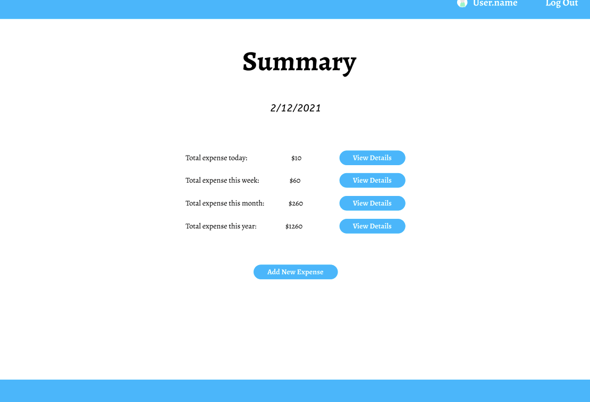
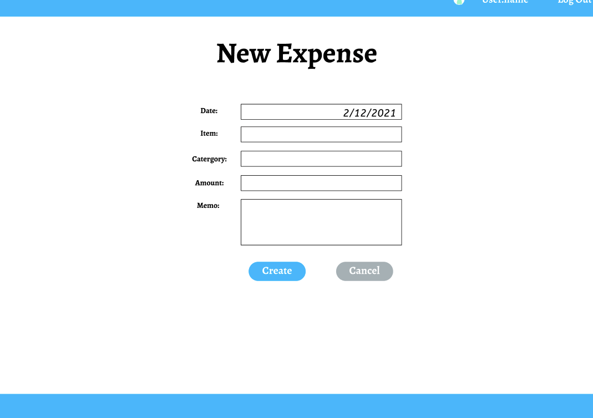

# Expense Tracker
## Wireframes

[Wireframe Figma Link](https://www.figma.com/file/oAsNmnZciQLCh7aLJpornA/Express-Project-Expense-Tracker)

### Home Route

### Main Page

### View by Day

### Create New Entry

## ERD

## User Stories
### As a Logged In User
- [ ]   Go to Summary page when logged in
- [ ]   Can use account setting page to upload img for profile pic
- [ ]   Have access to all types of views (day, week, month, year)
- [ ]   Can add new entry with category
- [ ]   Have access to deleting and updating entries in per day page
- [ ]   Have access to category page to edit categories
- [ ]   Back to main page when logged out
### As a Guest User
- [ ]   Go to Summary(guest) page when clicked
- [ ]   Have access to per day view
- [ ]   Can add new entry without category
- [ ]   Have access to deleting but not updating in per day page
- [ ]   Have access to create account
- [ ]   Delete all data when log out from guest account
